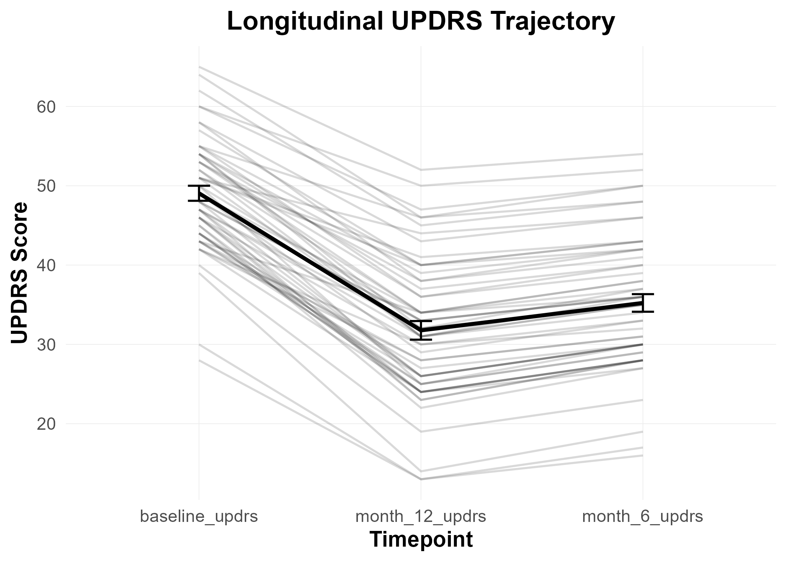

# Clinical Data Infrastructure Builder  
### Reproducible R Pipeline for Clinical Cohort Analysis  

**Author:** Ömer Tarık Çiçek, MD Candidate  
**Focus Area:** Movement Disorders & Functional Neurosurgery  
**Language:** R (tidyverse-based workflow)

---

## Overview

This repository demonstrates a structured and reproducible pipeline for clinical data processing in neurosurgical and movement disorder research.

The objective is to provide a structured framework for transforming raw clinical cohort data into:

- Clean, validated datasets  
- Derived clinical endpoints  
- Automated statistical analyses  
- Publication-ready visualizations  

The workflow reflects real-world clinical research requirements, including outlier detection, normality assessment, model building, and figure export at publication resolution.

---

## Repository Structure

```
Clinical-Data-Science-Toolbox/
│
├── data/
│   ├── mock_dbs_cohort.csv
│   └── cleaned/
│       └── cleaned_dbs_cohort.csv
│
├── scripts/
│   ├── 01_generate_mock_data.R
│   ├── 02_data_cleaning.R
│   ├── 03_statistical_analysis.R
│   └── 04_visualization.R
│
├── outputs/
│   ├── roc_curve.png
│   ├── paired_updrs_plot.png
│   └── trajectory_plot.png
│
└── README.md
```

---

## Workflow Components

### Data Generation
- - Example DBS cohort (n = 50)
- Demographic and perioperative variables
- Longitudinal UPDRS measurements

### Data Cleaning
- Missing value handling
- Date validation
- IQR-based outlier detection
- Derived clinical endpoints (absolute & percentage improvement)

### Statistical Analysis
- Shapiro–Wilk normality testing
- Automatic selection of parametric vs non-parametric tests
- Logistic regression modeling
- Odds ratio estimation
- ROC curve and AUC evaluation

### Visualization
- Paired baseline vs 12-month comparison
- Longitudinal cohort trajectory (mean ± SE)
- 300 DPI export for publication

---

## Example Output



---

## Reproducibility

All scripts are executed sequentially:

1. `01_generate_mock_data.R`
2. `02_data_cleaning.R`
3. `03_statistical_analysis.R`
4. `04_visualization.R`

Outputs are automatically written to the `/outputs` directory.

---

## Contact

Ömer Tarık Çiçek  
MD Candidate – Clinical Neuroscience & Data Science  

This repository is intended as a foundational framework for adaptation to real-world clinical datasets.


